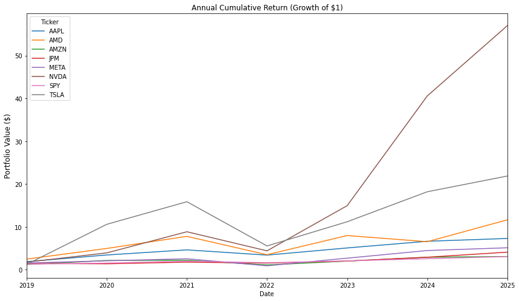
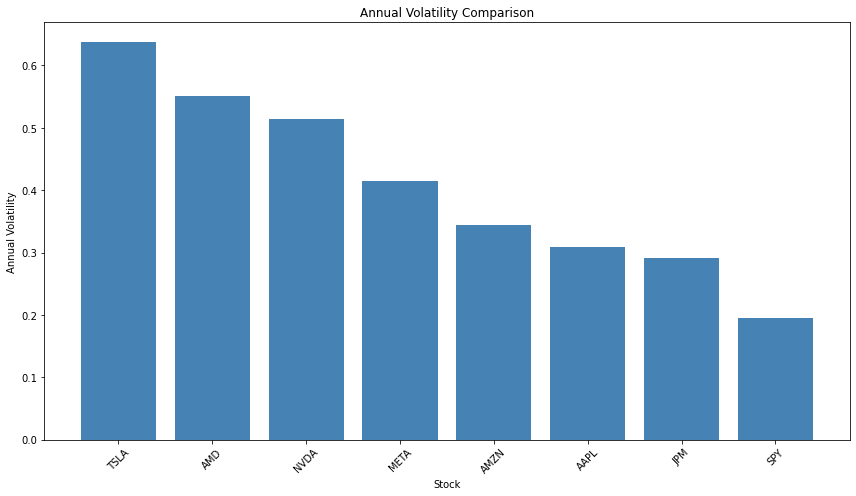
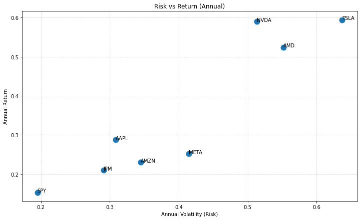
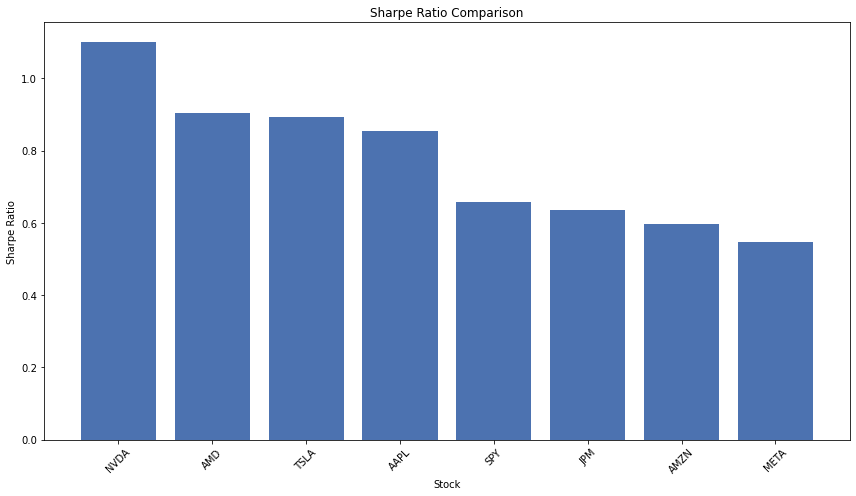
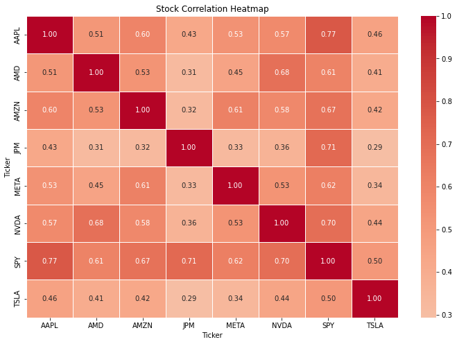

# Stock Market Analysis (2018-2025)

## Project Overview

This project analyzes the performance and risk characteristics of several major U.S. stocks using historical market data (2018-2025). The main objective of this analysis is to evaluate stock behavior over time, compare risk and return relationships, and get risk-adjusted performance.

Stocks used in this analysis are Apple, AMD, Amazon, JPMorgan Chase, Meta Platforms, NVIDIA, Tesla, S&P 500 ETF. The data was collected using the Yahoo Finance API and analyzed using Python.

## Data Collection
- Source: The dataset was obtained from the Yahoo Finance using the yFinance Python library
- Total columns: 48
- Total entries: 2007
- Key variables
    - Adjusted close price
    - Close price
    - High price
    - Low price
    - Open price
    - Volume
- Time period analyzed: 2018 - 2025
- Adjusted closing prices were primarily used as they are suitable for long-term performance analysis.

## Tools and Technologies Used
- pandas
- numpy
- matplotlib
- seaborn
- yfinance

## Skills Demonstrated
- Data visualization
- Correlation analysis
- Volatility analysis
- Financial return caculations

## Key findings
- The best performing stock was NVIDIA followed by TSLA and AMD. 
- Technology stocks gave stronger growth but also higher volatility. 
- The most volatile stock was TSLA and the least volatile was SPY. Diversified stock seems to be less volatile and have less returns.
- NVIDIA experienced exceptional growth, particulary after 2023, driven by increased demand for AI-related semiconductor technology (also AMD).
- Correlation analysis revealed that semiconductor stocks tend to move together, while some stocks like Tesla behave more independently.
- NVIDIA had the highest Sharpe ratio, indicating strong returns relative to risk.

## Visualization










```python

```
